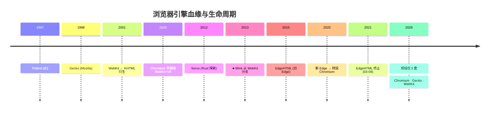
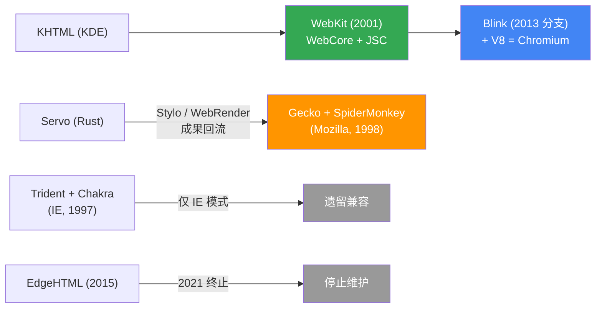
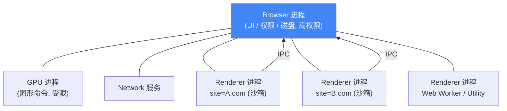
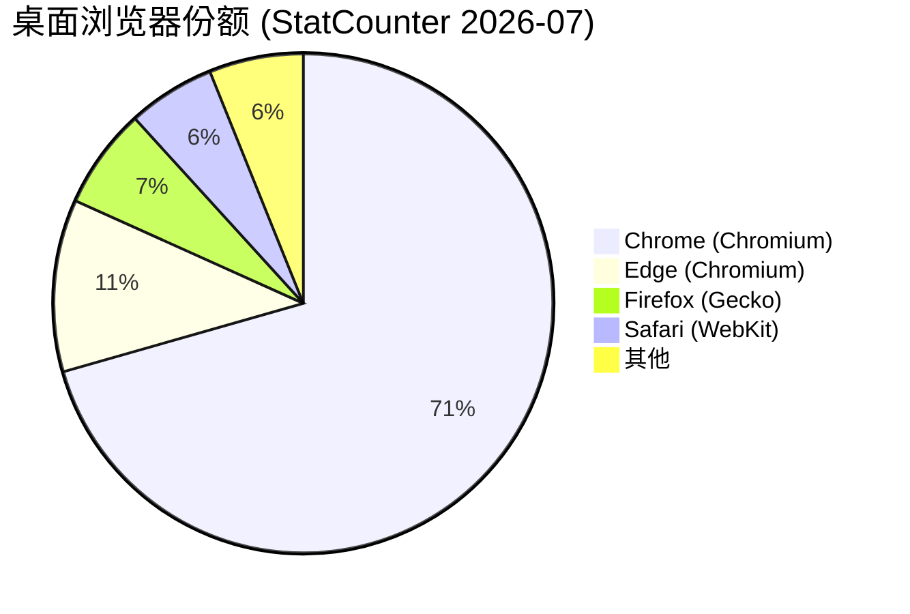
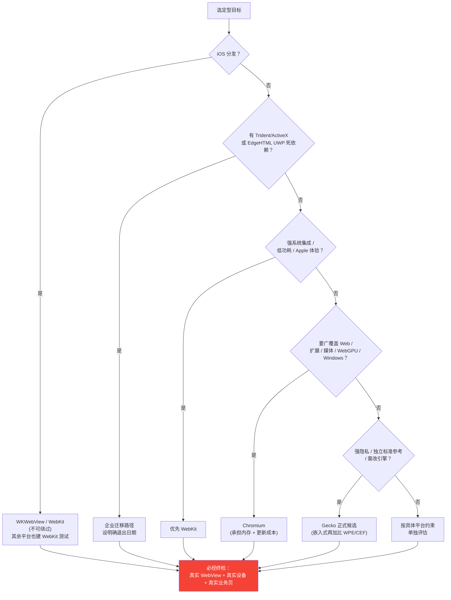
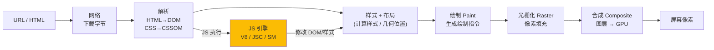

# 浏览器内核技术对比选型

> Chromium(Blink+V8) · Gecko(SpiderMonkey) · EdgeHTML · Trident/Chakra · WebKit(JSC)
> 截至 **2026-08**｜面向架构选型与技术适配

---

## 0. TL;DR — 一张图看懂



**核心结论**：可用于新产品的内核**只有三套**——Chromium、Gecko、WebKit；EdgeHTML 已死，Trident 仅存于 IE 模式（安全更新到 2029）。



> 上图要点：**Blink 源自 WebKit，而非 EdgeHTML**；Servo 的成果回流进 Gecko，并未替换它；两条红色虚线代表已退出历史舞台。

---

## 1. 概念澄清（最容易踩坑）

这五个名字**层级不同**，不能直接并列：

| 名称 | 精确口径 | 常见误称 |
|---|---|---|
| **Chromium** | Blink + V8 + Network/GPU/沙箱/UI 的完整项目 | ❌ "Chromium=Blink" |
| **Blink** | 渲染引擎：DOM/CSS/布局/绘制/合成 | —— |
| **V8** | JS/Wasm 引擎 | —— |
| **WebKit** | WebCore + JavaScriptCore + 平台嵌入层 | ❌ "WebKit=Safari"（iOS 第三方浏览器也被迫用它） |
| **Gecko** | 渲染引擎（C++/Rust） | ❌ "Gecko=SpiderMonkey"（后者只是其 JS 引擎） |
| **EdgeHTML** | 旧 Edge 引擎，**已终止** | ❌ "EdgeHTML=Blink 前身" |
| **Trident/MSHTML** | IE 渲染引擎 | ❌ 与 Chakra/JScript 混称 |

**血缘关系**：
- `WebKit(2001, KHTML 衍生)` → Google 早期采用 → **2013 分出 Blink**；但 V8、GPU 栈、站点隔离**并非**来自 WebKit。
- `Gecko` 独立起源；Servo 是 Mozilla 用 Rust 做的并行架构研究，**成果（Stylo/WebRender）回流进 Gecko**，并未替换它。

**精确公式**：
```
Chromium  = Blink + V8 + 浏览器基础设施
WebKit    = WebCore + JSC + 平台嵌入层
Gecko     = layout/style 子系统 + SpiderMonkey
```

---

## 2. 五大对象逐一拆解

### 2.1 Chromium / Blink / V8
**优势 = 兼容面 + 进程隔离 + DevTools + WebView 生态的组合**，而非单点渲染速度。

- **渲染管线**：`HTML→DOM→样式→布局→Paint→Raster→GPU合成`，高度并行；现代 Chromium 把 Blink/V8 放进**沙箱渲染进程**，独立 GPU 进程、Browser 进程持高权限；**站点隔离**按 site 拆分渲染进程。
- **V8 分层 JIT**：`Ignition(解释器) → Sparkplug(快速JIT) → Maglev(中层JIT) → TurboFan(优化JIT)`，冷启动与长时热代码走不同路径。（分层随 V8 版本演进，以官方设计文档为准）
- **代价**：多进程 ⇒ 更高常驻内存、IPC、初始化开销；**主线程长任务仍是瓶颈**（同步 JS、强制回流、大批量 DOM）。
- **生态**：Chrome/Edge/Opera/Vivaldi/Brave、Electron、WebView2、CEF、Android System WebView 共享其兼容面。
- **⚠️ iOS 硬约束**：第三方浏览器**必须用 WebKit**，"一套 Chromium 打天下"在 iOS 不成立。

**Chromium 多进程架构**（沙箱的核心）：



> **Site Isolation**：不同 site 的页面分到不同 Renderer 进程，即使 iframe 嵌套也隔离，是防 Spectre 类侧信道的关键。这也是"多进程 ≠ 隔离"的区别所在。

### 2.2 Gecko（+Servo 回流）
**唯一长期独立于 Chromium/WebKit 的主流桌面引擎，价值在多样性、隐私、可修改性。**

- 渲染路径：`HTML/DOM → frame tree → 样式/布局 → display list → 合成/绘制`。旧 Layers 架构已移除，**WebRender** 走 GPU 化 display list（scene building → frame building → GPU 命令）。
- **结论**："Gecko 一定 CPU 重"已过时，实际瓶颈取决于样式复杂度、display list 与 GPU 后端。
- **License**：MPL 2.0（允许与专有代码组合，但对修改文件有义务）。
- **代价**：Web 兼容差异、扩展生态、硬件集成需自建平台团队。
- **Servo/Ladybird**：仅作技术跟踪，**不可写入"已可用引擎矩阵"**。

### 2.3 EdgeHTML
**被 Chromium 替换的旧 Edge 引擎，不是 Blink 的前身。** 随 Windows 10 首发（2015-07-29）的 Legacy Edge/UWP WebView 引入；**2021-03-09 支持终止**。2026 年新项目**不应列入支持矩阵**，仅保留迁移盘点与回归测试价值。

### 2.4 Trident / MSHTML + Chakra/JScript
**IE 模式兼容引擎，不是现代 Web 基线。** 适配成本极高：ES5 边界、旧 JScript、`attachEvent`、`currentStyle`、ActiveX、VBScript、条件注释、X-UA-Compatible、NTLM/Intranet 隐式依赖。

**迁移顺序**：① 去 ActiveX/插件硬依赖 → ② 业务逻辑迁标准 API → ③ WebView2 承载 → ④ 功能开关逐步关 IE 模式 → **⑤ 设明确退出日期**。

### 2.5 WebKit / JSC
**Apple 平台事实引擎，iOS WebView 不可绕过。**

- `WebCore`(HTML/XML/CSS/SVG/MathML/Web API) + `JavaScriptCore`(ECMA-262)。
- **进程模型**：WebKit1 单进程 / **WebKit2 多进程**(UI + WebContent + Networking)，承载 WKWebView。
- **JSC 分层 JIT**：`LLInt → Baseline → DFG → FTL`，逐层升温；阈值随版本演进且因函数形态而异，**切勿当作跨版本固定的规范承诺**。
- **强项**：Metal/Core Animation/Power Management 深度协同 ⇒ Apple 平台能耗优势。
- **短板**：非 Apple 平台的图形栈、媒体能力、后端成熟度**不可等同 Safari**，须按 `(WebEngine版本, OS, 设备)` 三元组实测。

---

## 3. 横向对比总表

| 引擎 | 渲染层 / JS 引擎 | 进程模型 | License | 2026 状态 |
|---|---|---|---|---|
| **Chromium** | Blink / V8 | Browser+Renderer(沙箱)+GPU+Net；Site Isolation 按 site 分进程 | BSD-style | 现役首选兼容面；承担内存/更新/供应链责任 |
| **Gecko** | Gecko layout/style / SpiderMonkey(+Stylo/WebRender) | 内容/GPU/网络多进程 + 合成线程化(OMTC) | MPL 2.0 | 多样性/隐私/可修改性；需平台适配 |
| **WebKit** | WebCore / JSC(LLInt→FTL) | WK1 单进程 / WK2 多进程 | LGPL+BSD 混合 | Apple 平台事实引擎；iOS 不可绕过 |
| **EdgeHTML** | EdgeHTML / Chakra | 旧 Edge 多进程 | 专有 | 2021-03-09 终止；仅迁移/回归 |
| **Trident** | Trident / Chakra/JScript | IE 旧模型 | 专有 | 仅 IE 模式；安全更新至 2029 |

**三条比"谁最快"更可执行的结论**：
1. Chromium = **能力覆盖 + 供应链责任**的统一体。
2. Gecko / WebKit = Chromium 外的**两个独立实现锚点**（独立验证标准、不同隐私/平台策略）。
3. EdgeHTML / Trident **不应再占新产品测试矩阵**。

---

## 4. 性能、标准与功耗

### 4.1 不存在脱离工作负载的永久排名
三引擎都能构建高性能浏览器，**差异来自管线阶段 + 资源边界 + 工作负载**。单跑分无法区分解析/样式/布局/JS/GPU/网络。

| 维度 | Chromium | Gecko | WebKit | 测量建议 |
|---|---|---|---|---|
| 加载/交互 | streaming parse、V8 流水线 | Stylo 并行样式、WebRender | Apple 系统集成 | FCP/LCP/INP/TTFB + 网络瀑布 |
| JS/Wasm | Sparkplug/Maglev/TurboFan | SpiderMonkey 分层 JIT | LLInt/Baseline/DFG/FTL | Speedometer + JetStream + 真实 bundle |
| 布局/绘制 | 主线程 + compositor/GPU | display list + GPU | WebCore + 平台 GPU | devtools frame timeline |
| 内存 | 多进程偏高 | 取决于进程数/WebRender | Apple 重能耗优化 | RSS、GPU mem、长驻留曲线 |

### 4.2 桌面份额 ≠ 内核能力排名
StatCounter 2026-07 桌面快照：Chrome **70.58%** + Edge **11.15%**（**二者均 Chromium，绝不能相加称"Chromium份额"**）+ Firefox 6.51% + Safari 5.66%。



✅ 正确用法：**定测试优先级**。❌ 错误推导："份额高 ⇒ 所有负载最快 ⇒ 无需测 Gecko/WebKit"。

### 4.3 基准必须固定实验协议
Speedometer 3 测 *responsiveness*（几何均值）。正确流程：
1. 每版本 ≥5 轮；2. 异常轮记录原因（不静默删）；3. 用官方 CSV/JSON 汇总；4. 比几何均值+置信区间；5. **≥2 类真实业务页交叉验证**。

### 4.4 标准支持：按 `特性 × 版本 × flag × 宿主` 测量
CanIUse + MDN BCD **不能替代**目标 WebView/设备/OS/GPU 驱动/缩放/区域/flag 下的实测。选型"标准包"至少覆盖：CSS(Grid/Subgrid/Container Queries/`:has()`/Anchor)、ES(Top-level await/Temporal)、运行时(ESM/Worker)、图形(WebGL2/WebGPU/OffscreenCanvas)、网络(WebTransport)、存储(OPFS)、PWA、媒体、身份(WebAuthn)、嵌入式能力。**PWA 可行性取决于完整宿主链，而非有无 manifest。**

---

## 5. 前端适配实战

### 5.1 特性检测 > UA 嗅探
```js
// ✅ 能力即真理
if ('IntersectionObserver' in window) { /* 现代路径 */ }
else { /* 降级 */ }
```
配合 `CSS.supports()`、`matchMedia()`、`OffscreenCanvas`、`navigator.gpu`、SW 注册结果。**UA 嗅探**仅用于识别 Electron/WebView2/iOS-WKWebView 版本等**受控环境**，且须先检测能力、再 UA 佐证、保留兜底。

### 5.2 厂商前缀进入维护期
现代标准特性无需堆叠前缀；旧代码可清理：
```css
/* 旧：*/ -webkit-/-moz-/-ms-/-o-transition
/* 新：*/ transition
```
清理顺序：**① 确认目标范围 → ② CanIUse+MDN → ③ 视觉回归 → ④ 保留必要兼容**。勿机械删除仍被旧 WebView 使用的私有前缀。

### 5.3 各引擎主要适配风险
- **Chromium**：版本碎片化、Electron/WebView2 锁定、面向 Chrome 过度开发。固定 target major，跟踪 security advisories；Electron 须建模 `sandbox/nodeIntegration/contextIsolation`。
- **Gecko**：长尾页面假设了 Blink 细节。重点测滚动/合成/字体/`@layer`/`:has()`/Container Queries/WebRTC/DRM；CI 固定 latest + latest ESR。
- **WebKit**：iOS WebView 与 Safari 耦合。须测 `viewport-fit`、安全区、弹性滚动、全屏、autoplay、权限、Cookie/Storage、SW、后台生命周期、应用内导航——**真机外壳验证，勿靠桌面 Safari 推断**。
- **Trident/EdgeHTML**：旧 API 持续扩散，通过重写 + feature flag + 受控 IE 模式逐步退出。

### 5.4 统一渲染层架构
```
标准 Web UI → 能力适配器 → 原生桥适配器 → 平台宿主
```
遗留引擎**仅**进"能力适配器"受控分支；新功能默认不为旧引擎降级架构。宿主桥统一为**异步消息契约**，禁依赖 `window.chrome/.webkit/.MSStream` 随意组合。

---

## 6. 安全、扩展、License 与嵌入

### 6.1 沙箱 = 组合机制，而非"有没有"标签
三套现役均多进程，但验收须覆盖：站点隔离、跨域存储、权限策略、沙箱逃逸史、GPU 命令边界、扩展 API、下载区、WebAuthn、混合内容、**更新频率**。

- **iOS**：第三方 WebView 必用 WebKit，更新更依赖系统。
- **Android**：系统 WebView（OEM/Google 分发）**或** 自带 Chromium（更新/CVE/体积责任转给 App 方）。

### 6.2 扩展权限半径
默认走 **WebExtensions** 标准 API，最小化 `host_permissions`、远程代码、`eval`。Electron 勿把"能跑 Node"当安全特性——默认 `contextIsolation` + `sandbox`，敏感调用放主进程。

### 6.3 开源 ≠ 无合规成本
| 场景 | 首选 | 关键合规动作 |
|---|---|---|
| Android WebView | 系统 WebView / CEF / Electron 自带 | 版本矩阵、自动更新、系统依赖 |
| iOS App | **WKWebView**（必选） | ITP、后台策略、与 Safari 差异 |
| 桌面套壳 | Electron/CEF/WebView2 | 更新机制、体积、CVE SLA、品牌/专利 |
| 嵌入式/Linux/车载 | CEF/Chromium 或 **WPE/WebKit** | GPU/EGL、DRM、codec、内存、启动、LTS |

**闭源产品也必须**：① 生成 SBOM；② 保存上游 commit hash；③ 记录修改补丁；④ 保留 NOTICE/LICENSE；⑤ 明确动/静态链接；⑥ 应用内开源许可页；⑦ 建立安全升级 SLA。

---

## 7. 选型决策树与最小测试矩阵

### 7.1 决策树（先问约束，再问引擎）



### 7.2 最小测试矩阵

| 层级 | 必测组合 | 目的 |
|---|---|---|
| 桌面 Chromium | 最新 Chrome + 最新 Edge | 兼容面 + Chromium 内部差异 |
| 桌面独立实现 | 最新 Firefox + 1 个 ESR | Gecko 差异 + LTS 边界 |
| Apple 桌面 | macOS Safari + Safari TP | WebKit + 前瞻 API |
| 移动 WebView | iOS WKWebView + Android WebView 最低版 | **测 WebView，非桌面浏览器** |
| 嵌入式 | 目标 SoC + OS + WebEngine commit | GPU/内存/输入/codec/启动 |
| 遗留企业 | Chromium Edge + IE 模式 | **仅**验证受控旧资产 |

---

## 8. 扩展内容：实用诊断速查（★新增）

### 8.1 查 WebView / 引擎版本（调试必备）
```bash
# Android：查系统 WebView 包名与版本
adb shell dumpsys package com.google.android.webview | grep versionName
adb shell am start -a android.intent.action.VIEW -d "https://www.whatismybrowser.com"

# macOS：查 Safari / WebKit 版本
sw_vers; defaults read /Applications/Safari.app/Contents/Info.plist CFBundleVersion

# iOS 真机：通过 WKWebView 的 userAgent / navigator.userAgentData 读取
```

### 8.2 渲染性能定位套路
```
devtools Performance 录制
  → 找 Long Task (>50ms)
  → 看 Layout/Paint/Composite 占比
  → Rendering 面板开 "Paint flashing" / "Layout Shift Regions"
  → Memory 面板拍堆快照，比对 detached DOM
Chromium: chrome://gpu  # 看 GPU 后端与硬件加速状态
Gecko:   about:logging   # 布局/网络/存储诊断
```

### 8.3 快速术语表（★新增）
| 术语 | 含义 |
|---|---|
| Site Isolation | 按 site 拆分渲染进程，防跨站数据泄露 |
| Oilpan / PartitionAlloc | Blink 的 GC + 分配器 |
| OMTC | Off-Main-Thread Compositing（Gecko 线程化合成） |
| Stylo | Servo 并行样式系统，已并入 Gecko |
| WebRender | GPU 化 display-list 渲染路径 |
| WKWebView vs UIWebView | 前者多进程(WebKit2)、现行；后者已废弃 |
| Evergreen vs Fixed Version | WebView2 的"随系统更新" vs "锁定版本"分发模式 |
| WPT | Web Platform Tests，跨引擎一致性测试基准 |

---

## 9. 趋势与结论

### 确定性结论
- **Chromium = 最低公共兼容面**；**Gecko / WebKit = 必要独立实现锚点**。适配应围绕标准化 ES/CSS/Web API + 真实 WebView 版本 + 可复现测试，而非面向抽象引擎写分支。
- **性能选型 = 选工作负载**，不是选"最快"。Speedometer(responsiveness) ≠ JetStream(JS/Wasm) ≠ 加载/内存/功耗实验。
- **嵌入式/移动的决定因素是平台约束，不是桌面份额。** iOS 必 WebKit；Android 可选系统 WebView 或自带 Chromium；车载/Linux 比的是 BSP/GPU/内存/codec/LTS/License。

### 值得跟踪的新方向（审慎采用）
- **Servo / Ladybird**：证明 Rust + 并行 + GPU 合成路线可行，但量产选型前须验 **安全响应 / WPT / 媒体DRM / GPU后端 / WebDriver / 嵌入式ABI / LTS**。
- **AI × 隐私**：竞争焦点从"渲染速度"转向"代理能力 / 端侧模型 / 数据边界"。WebNN/WebGPU、AI Agent、权限提示、存储分区、跟踪防护、身份凭证都在放大**引擎↔OS 耦合**。架构上视 AI 能力为 `模型运行时 + 权限模型 + 页面能力` 的组合问题。

---

## 10. 科普专栏（读懂内核必备）

### 10.1 从敲下网址到看到像素，内核做了什么？
浏览器内核不是"一块黑箱"，而是**一条流水线**。简化如下：



每一步都可能是瓶颈：**网络慢**看 TTFB，**JS 长任务**卡主线程（INP），**频繁改样式**触发强制回流（Layout Thrashing），**图层过多**压垮 GPU 内存。**优化永远先测再改**——这正是第 8.2 节诊断套路的价值。

### 10.2 "引擎"到底指哪一层？
一个常见误解是把浏览器等同于"渲染引擎"。实际上一次页面呈现至少涉及三层：

| 层级 | 职责 | Chromium | Gecko | WebKit |
|---|---|---|---|---|
| **JS 引擎** | 解析执行 JS / Wasm | V8 | SpiderMonkey | JavaScriptCore |
| **渲染引擎** | DOM/CSS/布局/绘制 | Blink | Gecko layout | WebCore |
| **浏览器外壳** | UI、网络、存储、沙箱、下载 | Chromium 基础设施 | Firefox 外壳 | Safari / WKWebView |

**WebKit = WebCore + JSC + 平台嵌入层**，所以"WebKit 就是 Safari"是错的——iOS 上所有第三方浏览器都被迫用 WebKit，但它们各自有不同的外壳。反过来，**Chromium 是完整项目**（含外壳/网络/GPU/沙箱），Blink 才是对标 WebCore 的渲染引擎。这也是第 1 节反复强调"层级不同、不可并列"的原因。

### 10.3 为什么会有"标准"却仍有三大引擎？
Web 标准（HTML/CSS/ECMAScript/Web API）由 **W3C / WHATWG / ECMA** 制定，但**标准只规定"该做什么"，不规定"怎么实现"**。三家引擎各自写代码，再通过 **WPT (Web Platform Tests)** 这套跨引擎一致性测试基准对齐行为。

这带来两个关键认知：
- **三大引擎并存的价值 = 实现多样性**：若只剩一家，Web 标准实质上会被单一实现"绑架"（所谓 "Embrace, Extend, Extinguish" 的历史教训）。Gecko 与 WebKit 是 Chromium 之外的**独立验证锚点**。
- **兼容不等于完全相同**：哪怕都"支持某 API"，在精度、性能、bug、flag、GPU 后端上仍有差异——所以第 4.4 节强调必须按 `特性 × 版本 × flag × 宿主` 实测。

### 10.4 为什么 iOS 强制用 WebKit？（科普 Apple 的考量）
苹果要求 iOS 上所有浏览器引擎必须使用 WebKit，本质是**把引擎纳入系统统一管控**：统一的安全更新节奏、统一的隐私框架（如 ITP 智能防跟踪）、统一的能耗/后台策略、统一的 App Store 审核边界。

**对开发者的现实影响**：即便 Chrome/Firefox 在 iOS 上也只是"换壳的 WebKit"，行为与桌面版 Chromium/Gecko **并不等价**。因此"一套 Chromium 打天下"在 iOS 不成立，必须在真机 WKWebView 中验证（见第 5.3、7.2 节）。

### 10.5 一句话理解各引擎的"性格"
- **Chromium/Blink+V8**：工程完备、生态最广，代价是内存与"跟随更新"的责任。
- **Gecko+SpiderMonkey**：独立血脉、重视隐私与可修改性，是多样性的保险。
- **WebKit+JSC**：与 Apple 软硬件深度协同，能耗表现突出，iOS 的唯一通路。
- **EdgeHTML / Trident**：历史遗产，只服务于遗留系统迁移，不再进入新项目基线。

---

## 数据口径与局限
- 本报告截至 **2026-08**；EdgeHTML 终止(2021-03-09)、Trident IE 模式安全更新(至 2029)均为生命周期事实，不代表仍适合现代开发。
- 桌面份额来自 StatCounter（网站访问量推断），**非装机量、非引擎用量**；Chrome+Edge 同为 Chromium 宿主，**不可相加**。
- 性能图为固定协议示例，非厂商横评。CSS/JS 支持度、移动份额、嵌入式覆盖率**不整理为精确百分比**——引擎版本/OS/GPU驱动/flag/OEM/商店政策都会造成显著偏差；更可靠的做法是按目标版本维护**动态兼容矩阵 + 自动化测试 + 持续依赖升级**。

## 引用来源
[1] Microsoft Lifecycle — Edge Legacy（支持止于 2021-03-09）
[2] MDN — Glossary: Trident
[3] docs.webkit.org — Introduction / JavaScriptCore
[4] wiki.mozilla.org — Gecko:Overview / Quantum
[5] gs.statcounter.com — Desktop Browser Market Share (Jul 2026)
[6] browserbench.org — Speedometer 3
[7] chromium.googlesource.com — Design docs (Multi-process, Site Isolation, GPU)
[8] mozilla.org/MPL/2.0 — License
[9] webkit.org — Licensing WebKit
[10] MDN — Vendor Prefix / Microsoft Edge
